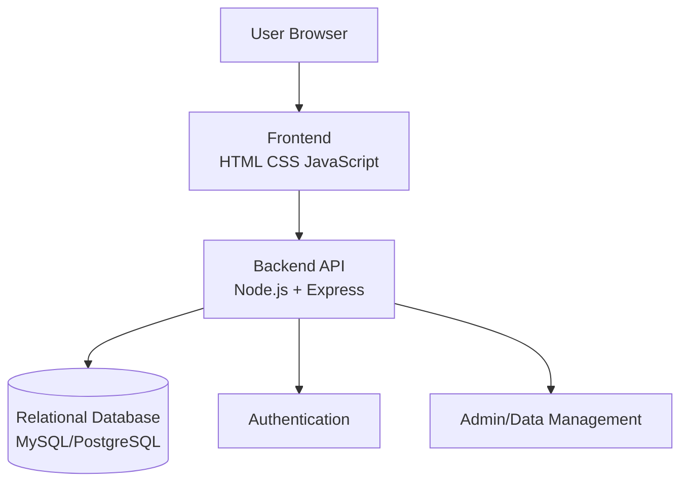

# Technical Requirements Document (TRD)
**Project:** The Ultimate Cheat-Meal & Street Food Finder  
**Version:** 1.0  
**Date:** 2026-09-24  
**Status:** DRAFT  
**BRD Reference:** BRD v1.0

## 1. System Overview
The system is a responsive web application backed by a relational database. The frontend provides food discovery and review interfaces. The backend exposes REST APIs and validates requests before interacting with the relational database.

## 2. Proposed Architecture


## 3. Technology Stack
| Layer | Technology | Purpose | BRD Link |
|---|---|---|---|
| Frontend | HTML5, CSS3, JavaScript | Responsive UI | FR-01 to FR-08 |
| Backend | Node.js + Express | REST API | FR-01 to FR-11 |
| Database | MySQL 8.x or PostgreSQL 16.x | Relational data storage | FR-03, FR-04, FR-07, FR-10 |
| API | REST/JSON | Frontend-backend communication | FR-01 to FR-11 |
| Version Control | Git + GitHub | Collaboration | Maintainability |
| Testing | API + SQL test cases | Verification | Success Criteria |

**Database decision:** The team must select one relational DBMS before implementation and use it consistently.

## 4. Data Model
### Vendors
- vendor_id PK
- vendor_name
- vendor_type
- description
- address
- contact
- opening_time
- closing_time
- created_at
- updated_at

### Categories
- category_id PK
- category_name
- description
- created_at
- updated_at

### Dishes
- dish_id PK
- vendor_id FK
- category_id FK
- dish_name
- description
- price
- spice_level
- availability
- created_at
- updated_at

### Users
- user_id PK
- full_name
- email UNIQUE
- password_hash
- created_at
- updated_at

### UserReviews
- review_id PK
- user_id FK
- dish_id FK
- rating CHECK (rating BETWEEN 1 AND 5)
- review_text
- review_date
- created_at
- updated_at

## 5. Relationships
- One Vendor can have many Dishes.
- One Category can contain many Dishes.
- One User can create many UserReviews.
- One Dish can have many UserReviews.
- A UserReview belongs to exactly one User and one Dish.

## 6. API Specifications
| Endpoint | Method | Auth | Description | BRD Link |
|---|---|---|---|---|
| /api/vendors | GET | Optional | List/search vendors | FR-01, FR-05 |
| /api/vendors/:id | GET | Optional | Vendor details and dishes | FR-02 |
| /api/categories | GET | Optional | List categories | FR-04 |
| /api/dishes | GET | Optional | Search/filter dishes | FR-03, FR-05, FR-06 |
| /api/dishes/:id | GET | Optional | Dish details and reviews | FR-03, FR-08 |
| /api/reviews | POST | Required | Create review | FR-07 |
| /api/dishes/:id/reviews | GET | Optional | List dish reviews | FR-08 |
| /api/ratings/top-vendors | GET | Optional | Aggregated vendor ratings | FR-09, FR-10 |

## 7. SQL Requirements
The implementation must demonstrate:
- CREATE DATABASE / schema setup
- CREATE TABLE
- Primary keys
- Foreign keys
- NOT NULL
- UNIQUE
- CHECK
- INSERT
- SELECT
- UPDATE
- DELETE
- WHERE
- LIKE
- JOIN
- GROUP BY
- HAVING
- ORDER BY
- COUNT
- AVG
- MIN / MAX where useful

Example:
```sql
SELECT v.vendor_name, AVG(r.rating) AS average_rating
FROM vendors v
JOIN dishes d ON d.vendor_id = v.vendor_id
JOIN user_reviews r ON r.dish_id = d.dish_id
GROUP BY v.vendor_id, v.vendor_name
ORDER BY average_rating DESC;
```

## 8. Security
- Hash passwords using an approved password-hashing algorithm.
- Validate all user input server-side.
- Use parameterized queries / prepared statements.
- Do not expose database credentials.
- Do not log passwords or authentication secrets.
- Restrict administrative operations to authorized users.

## 9. Testing
- Database constraint tests
- CRUD API tests
- Search/filter tests
- Foreign-key relationship tests
- Rating validation tests
- GROUP BY/aggregate query tests
- Invalid input tests
- Basic responsive UI tests

## 10. Traceability Matrix
| TRD Item | BRD Requirement | Status |
|---|---|---|
| Vendor API | FR-01, FR-02 | Planned |
| Dish API | FR-03 | Planned |
| Category model | FR-04 | Planned |
| Search/filter API | FR-05, FR-06 | Planned |
| Review API | FR-07, FR-08 | Planned |
| Rating aggregation | FR-09, FR-10 | Planned |
| Admin/data management | FR-11 | Planned |
| Foreign keys and constraints | Success Criteria | Planned |
| SQL JOIN/GROUP BY/aggregates | FR-09, FR-10 | Planned |

## 11. Approval
BRD Version Referenced: 1.0  
TRD Reviewer: ____________________  
Date: ____________________
