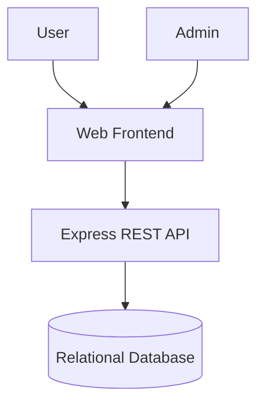
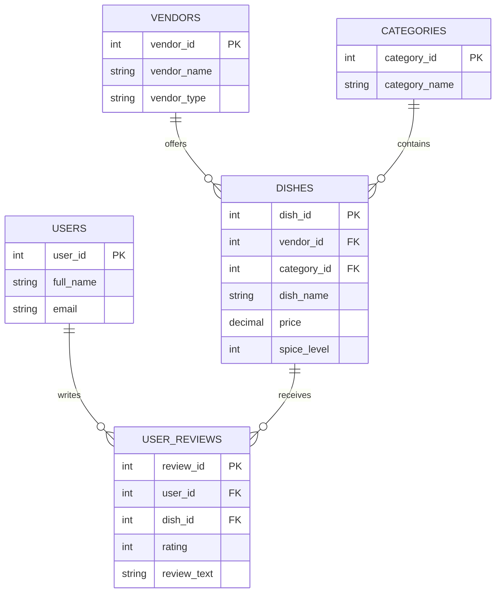
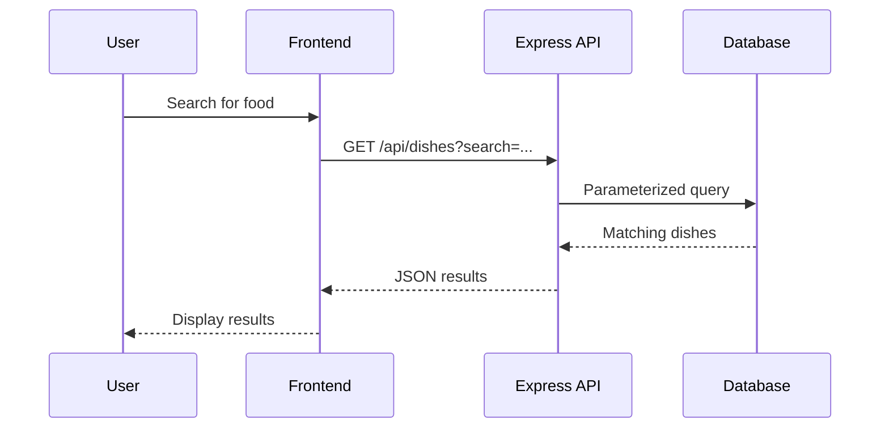

# Architecture Document
**Project:** The Ultimate Cheat-Meal & Street Food Finder  
**Version:** 1.0  
**Date:** 2026-09-24

## 1. System Context

## 2. Component Breakdown
### Frontend
- Home/search interface
- Category browser
- Vendor listing/details
- Dish listing/details
- Review display/form
- Responsive navigation

### Backend
- Vendor module
- Category module
- Dish module
- Review module
- User/authentication module
- Search/filter module
- Admin/data-management module

### Database
- vendors
- categories
- dishes
- users
- user_reviews

## 3. Data Relationships

## 4. Request Flow

## 5. Architectural Principles
- Keep frontend, backend, and database responsibilities separated.
- Keep SQL/database logic out of UI code.
- Validate input at the API boundary.
- Use foreign keys for relational integrity.
- Use parameterized queries.
- Keep documentation synchronized with implementation.
