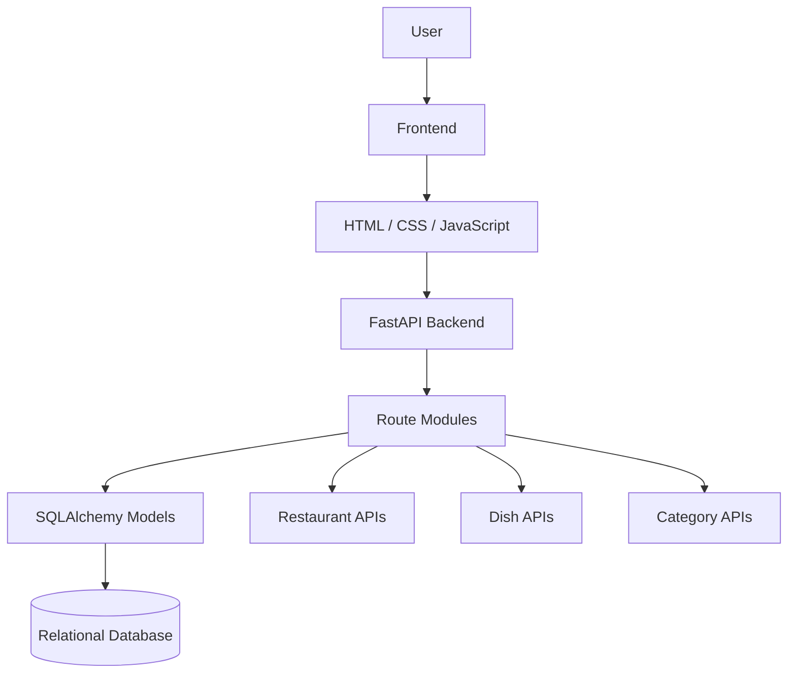

# 🍴 CraveSpot

### **The Ultimate Cheat-Meal & Street Food Finder**

> **Find what you're craving. Discover where to get it.**

CraveSpot is a food discovery web project designed to help users find dishes and restaurants based on their cravings. Instead of focusing mainly on food ordering and delivery, CraveSpot focuses on **discovering food, exploring categories, comparing options, and checking restaurant/dish details**.

---

## 👥 Team — The Confluence

| Member | Role |
|---|---|
| **Harsh Garg** | Team Leader / Documentation |
| **Simran** | Frontend |
| **Taranpreet** | Frontend |
| **Anshita** | Backend |
| **Divya** | Backend |
| **Babishya** | Database |
| **Anshuman** | Database |
| **Majid** | Testing / QA |

**Project:** CraveSpot  
**Official Title:** The Ultimate Cheat-Meal & Street Food Finder  
**Course:** B.Tech CSE

---

## 📌 Problem Statement

Finding the right food can be difficult when a user knows what they are craving but does not know which dish or restaurant to choose.

Some common problems are:

- Food options are spread across different platforms.
- Users may know the type of food they want but not where to find it.
- Comparing dishes and restaurants can take time.
- Users may want to explore food by category, price, rating, or other filters.
- Many food platforms are mainly focused on ordering and delivery rather than simple food discovery.

### 💡 Our Idea

**CraveSpot makes food discovery simpler by bringing dishes, categories, restaurants and useful details into one platform.**

---

## ✨ Main Features

- 🔎 **Food Search** — Search for dishes and food options.
- 🍕 **Category Browsing** — Explore different food categories.
- 🍽️ **Dish Listing** — View available dishes.
- 🏪 **Restaurant Listing** — Explore restaurants/vendors.
- 📋 **Dish Details** — View information about a selected dish.
- 🏪 **Restaurant Details** — View information about a restaurant.
- ⭐ **Ratings & Reviews** — Planned interface for food feedback.
- 🔐 **Login/Register** — User authentication interface.
- 🎛️ **Filters & Sorting** — Narrow down food choices.
- 📱 **Responsive Design** — Interface planned for desktop and mobile screens.

---

## 🖼️ Food Preview

<table>
<tr>
<td align="center">
<br>
<b>Classic Cheese Pizza</b>
</td>
<td align="center">
<br>
<b>Classic Chicken Burger</b>
</td>
<td align="center">
<br>
<b>Chicken Biryani</b>
</td>
<td align="center">
<br>
<b>Steamed Veg Momos</b>
</td>
</tr>
</table>

---

## 🔄 How CraveSpot Works

```text
        👤 USER
           │
           ▼
   🔎 Search / Categories
           │
           ▼
      🎛️ Filters
           │
           ▼
     🍽️ Food Results
           │
      ┌────┴────┐
      ▼         ▼
  🍴 Dish    🏪 Restaurant
  Details      Details
      │         │
      └────┬────┘
           ▼
      ⭐ Reviews
           │
           ▼
      🍴 Food Choice
```

### Simple User Flow

**Home → Search / Category → Results → Dish Details → Restaurant Details → Reviews**

---

## 🛠️ Technology Stack

### Frontend

- **HTML5** — Page structure
- **CSS3** — Styling and layouts
- **JavaScript** — Client-side interactions
- Responsive page structure for the planned desktop/mobile experience

### Backend

- **Python**
- **FastAPI**
- **SQLAlchemy**
- **Pydantic response schemas**
- REST-style route structure

The current project contains backend modules for restaurants, dishes and categories.

### Database / Data Layer

- Relational data model
- **SQLAlchemy ORM**
- Restaurants
- Dishes
- Categories
- Relationships between core entities
- **MySQL is the project database target**

> **Current status:** The uploaded project contains SQLAlchemy models and relationships, while complete live database connection/integration is still in progress.

### Version Control

- **Git**
- **GitHub**

---

## 🧩 Project Architecture



### Architecture Layers

| Layer | Responsibility |
|---|---|
| **Frontend** | User interface, pages, search and interactions |
| **API / Backend** | Handles application routes and request processing |
| **Models** | Represents restaurants, dishes and categories |
| **Database** | Stores structured food and restaurant information |

---

## 📂 Project Structure

```text
CraveSpot/
│
├── assests/
│   └── images/
│       ├── butter-chicken.jpg
│       ├── chicken-biryani.jpg
│       ├── chilli-garlic-noodles.jpg
│       ├── chocolate-brownie.jpg
│       ├── classic-cheese-pizza.jpg
│       ├── classic-chicken-burger.jpg
│       ├── loaded-fries.jpg
│       └── steamed-veg-momos.jpg
│
├── css/
│   ├── categories.css
│   ├── details.css
│   ├── dish-details.css
│   ├── dishes.css
│   ├── login.css
│   ├── restaurants.css
│   └── style.css
│
├── js/
│   ├── app.js
│   ├── categories.js
│   ├── details.js
│   ├── dish-details.js
│   ├── dishes.js
│   ├── login.js
│   └── restaurants.js
│
├── pages/
│   ├── categories.html
│   ├── dish-details.html
│   ├── dishes.html
│   ├── login.html
│   ├── restaurant-details.html
│   └── restaurants.html
│
├── index.html
│
├── Route/
│   ├── category.py
│   ├── dish.py
│   └── restaurant.py
│
├── models/
│   ├── category.py
│   ├── dish.py
│   └── restaurant.py
│
└── Schemas/
    ├── category.py
    ├── dish.py
    └── restaurant.py
```

---

## 🔌 Backend Modules

The current backend structure contains route modules for:

### 🏪 Restaurants

- List restaurants
- Search/filter restaurants
- Get restaurant details
- Get dishes belonging to a restaurant

### 🍽️ Dishes

- Search dishes
- Filter by category
- Filter by restaurant
- Vegetarian filtering
- Price/rating filtering
- Sorting

### 🗂️ Categories

- List categories
- Get category information

### 📦 Schemas

Pydantic schemas are used for structured API responses.

---

## 📊 Current Project Progress

**Current Stage:**

> **Requirements & Project Setup → Initial Frontend Development**

### Completed / Established

- ✅ Project requirements discussed
- ✅ Team roles assigned
- ✅ GitHub repository and project structure set up
- ✅ Project documentation and planning started
- ✅ Initial frontend development started
- ✅ Frontend pages and assets are present
- ✅ Backend route/model modules are present

### In Progress

- 🔄 Complete frontend screens and responsive layouts
- 🔄 Connect frontend with backend APIs
- 🔄 Finalize database setup and integration
- 🔄 Integrate database-driven food/restaurant information
- 🔄 Testing and bug fixing

> The project is currently under active development. Full frontend-backend-database integration is **not being claimed as complete yet**.

---

## 👨‍💻 Team Progress

| Member | Responsibility | Current Work |
|---|---|---|
| **Harsh Garg** | Team Leader / Documentation | Coordination, GitHub, documentation, frontend planning |
| **Simran** | Frontend | Frontend structure and initial UI |
| **Taranpreet** | Frontend | Pages/components and UI requirements |
| **Anshita** | Backend | Technical requirements and backend setup |
| **Divya** | Backend | Backend structure and requirements |
| **Babishya** | Database | Database requirements and structure |
| **Anshuman** | Database | Database setup and requirements |
| **Majid** | Testing / QA | Testing approach and requirements review |

**Overall status:** 🟡 **In Progress**

---

## 🚀 Getting Started

### 1. Clone the repository

```bash
git clone https://github.com/vortex-001/CraveSpot.git
cd CraveSpot
```

### 2. Frontend

The frontend can be opened through:

```text
index.html
```

For a better local development experience, use a local server such as VS Code Live Server.

### 3. Backend

The backend code is organized into:

```text
Route/
models/
Schemas/
```

The FastAPI/backend integration is currently being developed, so the complete production run configuration is still being finalized.

---

## 🔧 Git Workflow for the Team

Before starting work:

```bash
git pull
```

After making changes:

```bash
git add .
git commit -m "Describe your changes"
git push
```

### Example

```bash
git add .
git commit -m "Added restaurant details page"
git push
```

---

## 🔮 Future Scope

The project can be extended with:

- 🤖 Personalized food recommendations
- 📍 Maps and location-based restaurant discovery
- 🔎 More advanced search and filters
- ❤️ Personalized favourites
- 👤 User profiles
- ⭐ Complete rating and review system
- 🛠️ Admin dashboard
- 🌆 Support for more cities and locations
- 📱 Progressive Web App / mobile version
- 📈 More detailed food and restaurant analytics

---

## 🎯 Project Goal

The goal of CraveSpot is simple:

> **Make it easier for people to decide what to eat and discover where they can find it.**

CraveSpot is focused on the **food discovery experience** rather than food delivery.

---

## 📚 Academic Project

This project is being developed as a **B.Tech Computer Science & Engineering project** by **The Confluence**.

### Project Details

**Project Name:** CraveSpot  
**Official Title:** The Ultimate Cheat-Meal & Street Food Finder  
**Team:** The Confluence  
**Team Leader:** Harsh Garg  
**Course:** B.Tech CSE

---

## ⭐ Support the Project

If you find the project useful, consider giving the repository a ⭐ on GitHub.

---

<p align="center">
  <b>🍴 CraveSpot — The Ultimate Cheat-Meal & Street Food Finder</b><br>
  <i>Discover your craving. Find your food.</i>
</p>
change   
